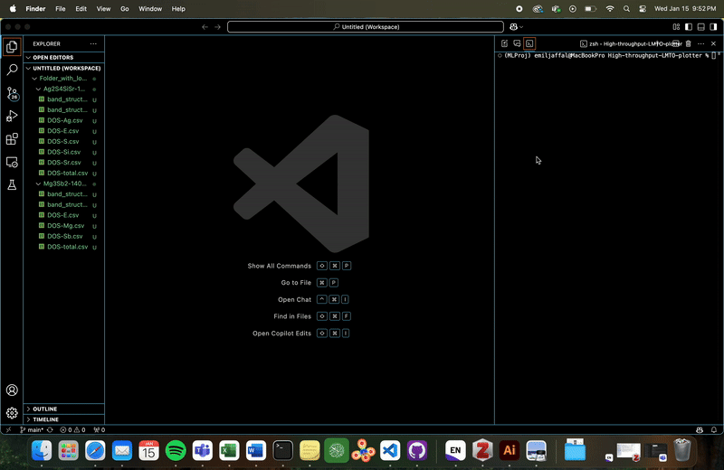

# High-throughput LMTO plotter

[](https://github.com/EmilJaffal/High-throughput-LMTO-plotter/blob/main/LICENSE)


This script parses .csv files produced by the [high-throughput LMTO package](https://github.com/balaranjan/High-throughput-LMTO) and automatically produces easily readable & aesthetically pleasing plots ready for publication, posters or presentations. Run the plotter.py file and input the directory to either: a folder (titled with the composition/structure) or a folder (that can be any name) of folders (titled with the composition/structure). 

The plotter so far can generate density of states, bandstructure and COHP plots for LMTO. The software is also very easily changeable to adjust axes, titles, etc.

> The current README.md serves as a tutorial and documentation - last update June 21, 2025

## Demo

The code is designed for interactive use without the need to write any code.



## Getting started

Copy each line into your command-line applications. The code needs (i) a path to the directory with either: a folder with the calculation outputs (titled with the respective composition/structure) or a folder (that can be any name) of folders of structures (titled with the respective composition/structure) with the calculation outputs.

```bash
$ git clone https://github.com/EmilJaffal/High-throughput-LMTO-plotter
$ cd High-throughput-LMTO-plotter
$ pip install -r requirements.txt
$ python plotter.py
```

Once the code is executed using `python plotter.py`, the following prompt will
appear, asking you to input a path:

```text
Would you like to process a folder of different structures? (y/n): y
```

You may then choose either a folder containing the DOS, COHP and/or bandstructure .csv outputs of a single structure or a folder filled with them.

```text
Would you like to process a folder of different structures? (y/n): y
```

Selecting y only if it is a directory containing multiple folders of calculation outputs, and n if it is a single folder.

```text
Choose an option for all folders: 1. Plot DOS, 2. Plot band structure, 3. Plot COHP, 4. Plot all of the above:
```

and you're left with:

```text
Processing folder: /Users/emiljaffal/documents/github/High-throughput-LMTO-plotter/Folder_with_lots_of_structures/Mg3Sb2-1406602
Plot saved to: /Users/emiljaffal/documents/github/High-throughput-LMTO-plotter/Folder_with_lots_of_structures/Mg3Sb2-1406602/Mg3Sb2-1406602_DOS.png
Plot saved to: /Users/emiljaffal/documents/github/High-throughput-LMTO-plotter/Folder_with_lots_of_structures/Mg3Sb2-1406602/Mg3Sb2-1406602_DOS_noE.png
Plot saved to: /Users/emiljaffal/documents/github/High-throughput-LMTO-plotter/Folder_with_lots_of_structures/Mg3Sb2-1406602/Mg3Sb2_bandstructure.png
Plot saved to: /Users/emiljaffal/documents/github/High-throughput-LMTO-plotter/Folder_with_lots_of_structures/Mg3Sb2-1406602/Mg3Sb2_COHP.png

teehee tnx!
```

## Installation

```bash
$ git clone https://github.com/EmilJaffal/High-throughput-LMTO-plotter
$ cd High-throughput-LMTO-plotter
$ pip install -r requirements.txt
$ python plotter.py
```

## Contributors

- [Emil Jaffal](https://github.com/EmilJaffal)
- [Balaranjan Selvaratnam](https://github.com/balaranjan)
- Anton Oliynyk

## How to ask for help

- If you have any issues or questions, please feel free to reach out or
  [leave an issue](https://github.com/emiljaffal/High-throughput-LMTO-plotter/issues).
